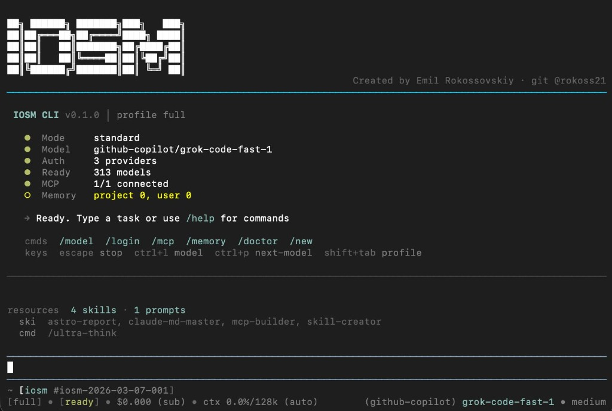

<p align="center">
  <h1 align="center">iosm-cli</h1>
  <p align="center">
    <strong>AI Engineering Runtime for Professional Developers</strong>
  </p>
  <p align="center">
    Interactive coding agent · IOSM methodology · MCP · Checkpoints · Subagent orchestration · Extensions
  </p>
</p>

<p align="center">
  <a href="https://www.npmjs.com/package/iosm-cli"></a>
  <a href="https://www.npmjs.com/package/iosm-cli"></a>
  <a href="https://opensource.org/licenses/MIT"></a>
  
  <a href="https://github.com/rokoss21/iosm-cli"></a>
</p>

<p align="center">
  
</p>

---

`iosm-cli` is not a chat wrapper around an LLM.

It is an engineering runtime designed for production work:
- a terminal-native coding agent with real file/shell tools
- repeatable improvement workflows via **IOSM** (Improve -> Optimize -> Shrink -> Modularize)
- operational controls for safe iteration (`/checkpoint`, `/rollback`, `/doctor`, `/memory`)
- extensibility for teams (MCP, extensions, SDK, JSON/RPC modes)

## Why It Exists

Most AI CLIs optimize for conversation.
`iosm-cli` optimizes for engineering execution quality.

| Area | Typical AI CLI | `iosm-cli` |
|------|----------------|------------|
| Workflow | Prompt-by-prompt | Structured session + IOSM cycles |
| Safety | Basic confirmations | Checkpoints, rollback, diagnostics, permission policies |
| Context ops | Ad hoc notes | Managed memory with interactive edit/remove |
| Tooling | Built-ins only | Built-ins + MCP + extension tools |
| Integrations | Mostly interactive only | Interactive + print + JSON + JSON-RPC + SDK |

## Who It Is For

- senior engineers and tech leads running non-trivial refactors
- platform/backend teams that need reproducible improvement loops
- teams building internal coding automation on top of a CLI runtime

## Install

```bash
npm install -g iosm-cli
iosm --version
```

Requirements:
- Node.js `>=20.6.0`
- provider auth (environment variable API key and/or `/login`)

## 60-Second Start

```bash
# 1) Open your project
cd /path/to/repo

# 2) Start interactive mode
iosm
```

Inside the session:
1. `/login` (or `/auth`) to configure provider credentials.
2. `/model` to select the active model.
3. Ask your task.

High-value first commands:
- `/doctor` - verify model/auth/MCP/resources state
- `/mcp` - inspect/add/enable MCP servers in interactive UI
- `/memory` - store persistent project facts and constraints
- `/checkpoint` then `/rollback` - safe experimentation loop

## Core Commands

| Goal | Command |
|------|---------|
| Start fresh session | `/new` or `/clear` |
| Set auth | `/login` or `/auth` |
| Pick model | `/model` |
| Diagnose setup | `/doctor` |
| Manage MCP servers | `/mcp` |
| Manage session memory | `/memory` |
| Save/restore state | `/checkpoint` / `/rollback` |
| Manage settings | `/settings` |

## IOSM In One Line

**IOSM** gives you a repeatable loop for improving codebases with explicit quality gates, metrics, and artifact history instead of one-off AI edits.

Quick start:

```bash
iosm init
iosm cycle plan "reduce API latency" "simplify auth module"
iosm cycle status
iosm cycle report
```

## Documentation

Use the docs as the source of truth for details.

| Topic | Link |
|------|------|
| Getting started | [docs/getting-started.md](./docs/getting-started.md) |
| CLI flags and options | [docs/cli-reference.md](./docs/cli-reference.md) |
| Interactive mode (commands, keys, profiles) | [docs/interactive-mode.md](./docs/interactive-mode.md) |
| IOSM init/cycles | [docs/iosm-init-and-cycles.md](./docs/iosm-init-and-cycles.md) |
| MCP, providers, settings | [docs/configuration.md](./docs/configuration.md) |
| Orchestration and subagents | [docs/orchestration-and-subagents.md](./docs/orchestration-and-subagents.md) |
| Extensions, packages, themes | [docs/extensions-packages-themes.md](./docs/extensions-packages-themes.md) |
| Sessions, traces, export | [docs/sessions-traces-export.md](./docs/sessions-traces-export.md) |
| JSON/RPC/SDK usage | [docs/rpc-json-sdk.md](./docs/rpc-json-sdk.md) |
| Full docs index | [docs/README.md](./docs/README.md) |
| Full IOSM specification | [iosm-spec.md](./iosm-spec.md) |

## Development

```bash
npm install
npm run check
npm test
npm run build
```

Contributing guide: [CONTRIBUTING.md](./CONTRIBUTING.md)

## License

[MIT](./LICENSE) © 2026 Emil Rokossovskiy

<p align="center">
  <sub>Built for engineering teams who want controllable AI-assisted development.</sub>
</p>
